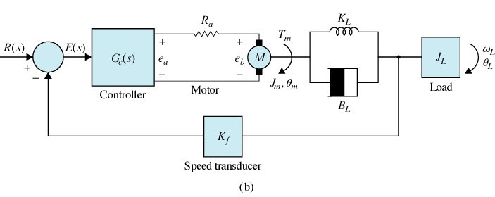

# Control2
## UNIVERSIDAD RICARDO PALMA
## FACULTAD DE INGENIERÍA / INGENIERÍA MECATRÓNICA
## ASIGNATURA: INGENIERÍA DE CONTROL II – LABORATORIO 2-3-4 2018-2
## MODELACIÓN, ANÁLISIS Y DISEÑO DE UN SISTEMA DE CONTROL DE POSICIÓN MEDIANTE VARIABLES DE ESTADO*
Considere el sistema basado en un motor DC que mueve una carga que se muestra en la figura (a). La constante KL representa la constante de elasticidad de la cinta y BL denota el coeficiente de fricción viscosa entre la cinta y las poleas.

Los otros parámetros del sistema son:
Km = constante de torque del motor =  10 oz-in/A 
Kb = constante de fcem del motor = 0.07 V/rad/sec
Bm = coeficiente de fricción del motor = 3 oz-in/rad/sec
Ra = 0.25 Ω                                              La = 0 H
KL = 3000 oz-in/rad                               BL = 10 oz-in/rad/sec
JL = 6 oz-in/rad/sec2                              Jm = 0.05 oz-in/rad/sec2

*Basado en el problema 10-29 del Capítulo 10 del libro Automatic Control Systems de Kuo y Golnaraghi. 

## LABORATORIO 2: Modelación de la planta
1.	Planteando las ecuaciones dinámicas del sistema, elabore el modelo en variables de estado de la planta considerando:
Entrada: u = ea = voltaje
Salida: ϴL : posición angular de la carga
Variables de estado: x1 = ϴL   , x2 = dϴL/dt  ,  x3 = ϴm   , x4 = dϴm/dt

2.	Mediante un diagrama Simulink, observe el comportamiento en el tiempo de la posición angular ƟL(t) y la velocidad angular de la carga WL(t), cuando el voltaje de entrada ea es igual a 5 voltios.

3.	Establezca conclusiones sobre el funcionamiento de la planta, en base a los resultados de la parte 2.

## LABORATORIO 3: Análisis con un controlador P
1.	El control de la posición angular de la carga se va a realizar en lazo cerrado tal como se muestra en la figura (b), siendo el controlador proporcional: GC(s) = KC y la ganancia del sensor de posición Kf = 1 V/rad.

 Determine el máximo valor de la ganancia KC antes que el sistema en lazo cerrado sea oscilatorio.
2. Determine el valor de KC tal que la respuesta del sistema a una entrada de referencia R: escalón unitario tenga un máximo sobreimpulso menor al 5%.  ¿Cuánto es el tiempo de establecimiento?. ¿Existe error estacionario?.
3. Con el valor de KC obtenido en el punto anterior, obtenga la gráfica de la respuesta del sistema a una entrada de referencia R: rampa unitaria. ¿Existe error estacionario?.
4. Establezca conclusiones sobre el efecto del controlador proporcional empleado, en base a los resultados obtenidos. Realice las simulaciones adicionales que considere necesarias.
## LABORATORIO 4: Diseño de un controlador mediante realimentación de estados.
Se muestra el diagrama de bloques para el control tipo servosistema, el cual permite el seguimiento de una referencia a la posición angular de la carga ϴL.  Se ha adicionado un integrador debido a que la planta no posee integrador que permita tener error estacionario cero a una entrada de referencia escalón. 

 

1.	Mediante los comandos de MATLAB averigüe las características de la planta, como controlabilidad, estabilidad y si tiene integrador. Para el cálculo de las ganancias de las realimentaciones y del integrador, considere que se desea una respuesta transitoria con mínima oscilación y un tiempo de establecimiento de aproximadamente 4 segundos.

2.	Mediante un esquema en Simulink, efectúe la simulación cuando la señal de referencia r es tipo onda cuadrada de periodo 12 seg. Muestre los gráficos de la posición angular de la carga.

3.	Repita los pasos 1 y 2 considerando que ahora se desea una respuesta transitoria sin oscilaciones con tiempo de establecimiento de 4 segundos.

4.	Establezca conclusiones sobre el funcionamiento del sistema en base a los resultados de las simulaciones. Establezca comparaciones de ambos diseños.
